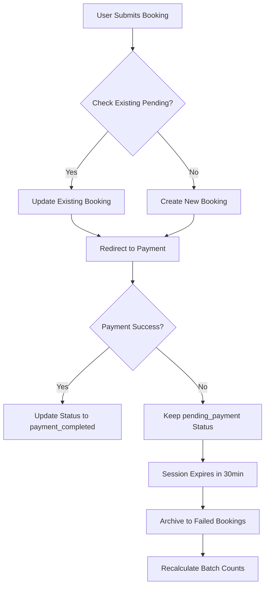

# Pending Payment Booking Solution

## Problem
When users attempt to book a trek and payment fails multiple times, the system was creating multiple bookings with `pending_payment` status, leading to:

1. **Orphaned bookings** that never get paid
2. **Inconsistent participant counts** (spots appear taken but aren't actually booked)
3. **Poor user experience** with multiple failed booking attempts
4. **Data cleanup issues** for admins

## Solution Overview

The solution implements a **Booking Session Management** system that:

1. **Prevents duplicate bookings** for the same user, trek, and batch
2. **Tracks booking sessions** with expiration times
3. **Archives failed bookings** instead of deleting them
4. **Maintains accurate participant counts**

## Implementation Details

### 1. Database Schema Changes

**Booking Model Updates** (`backend/models/Booking.js`):
```javascript
bookingSession: {
  sessionId: String,           // Unique session identifier
  expiresAt: Date,            // Session expiration (30 minutes)
  paymentAttempts: Number,    // Track payment attempts
  lastPaymentAttempt: Date    // Last payment attempt timestamp
}
```

### 2. Backend Logic

**Booking Creation** (`backend/controllers/bookingController.js`):
- Checks for existing pending bookings before creating new ones
- Updates existing booking instead of creating duplicates
- Tracks payment attempts and session expiration
- Only updates batch participant count for new bookings

**Key Functions**:
- `createBooking()` - Modified to handle session management
- `getExistingPendingBooking()` - Check for existing pending bookings
- `cleanupExpiredBookings()` - Admin cleanup function

### 3. Frontend Integration

**Booking Page** (`frontend/src/pages/BookingPage.js`):
- Generates unique session IDs for each booking attempt
- Checks for existing pending bookings before submission
- Redirects to existing payment page if found

**API Functions** (`frontend/src/services/api.js`):
- `checkExistingPendingBooking()` - Check for existing bookings
- `cleanupExpiredBookings()` - Admin cleanup function

### 4. Failed Booking Archiving

**New FailedBooking Model** (`backend/models/FailedBooking.js`):
- Stores complete booking data for failed payments
- Tracks failure reasons (session_expired, payment_failed, user_cancelled, system_error)
- Maintains original booking metadata and payment attempt history
- Preserves all information for potential restoration

**Cleanup Script** (`backend/scripts/cleanupPendingBookings.js`):
- Archives expired pending payment bookings to FailedBooking collection
- Recalculates batch participant counts
- Handles both session-based and time-based expiration
- Preserves booking data for analysis and potential restoration

**Cron Jobs** (`backend/scripts/setupCronJobs.js`):
- Runs cleanup every 15 minutes in production
- Automatically maintains data integrity

### 5. Admin Tools

**Admin Dashboard** (`frontend/src/pages/AdminDashboard.js`):
- Manual cleanup button for expired bookings
- Link to Failed Bookings management page
- Real-time feedback on cleanup operations

**Failed Bookings Management** (`frontend/src/pages/admin/FailedBookings.js`):
- View all archived failed bookings with filtering
- Restore failed bookings (creates new pending payment booking)
- Export failed bookings to Excel
- Delete failed bookings permanently
- Statistics and analytics on failure reasons

## Flow Diagram



## Configuration

### Session Expiration
- **Default**: 30 minutes
- **Configurable**: Modify `expiresAt` calculation in `createBooking()`

### Cleanup Frequency
- **Production**: Every 15 minutes (cron job)
- **Manual**: Admin dashboard button
- **Configurable**: Modify cron schedule in `setupCronJobs.js`

## API Endpoints

### New Endpoints
- `GET /api/bookings/check-pending` - Check for existing pending bookings
- `POST /api/bookings/cleanup-expired` - Manual cleanup (admin only)
- `GET /api/failed-bookings` - Get failed bookings with filtering
- `GET /api/failed-bookings/:id` - Get specific failed booking details
- `POST /api/failed-bookings/:id/restore` - Restore failed booking
- `DELETE /api/failed-bookings/:id` - Delete failed booking permanently
- `GET /api/failed-bookings/export/excel` - Export failed bookings to Excel

### Modified Endpoints
- `POST /api/bookings` - Now handles session management

## Usage Examples

### Check Existing Pending Booking
```javascript
const result = await checkExistingPendingBooking(trekId, batchId);
if (result.exists) {
  // Redirect to existing payment page
  navigate(`/payment/${result.booking._id}`);
}
```

### Manual Cleanup (Admin)
```javascript
await cleanupExpiredBookings();
// Returns success message with timestamp
```

### Run Cleanup Script Manually
```bash
node backend/scripts/cleanupPendingBookings.js
```

## Benefits

1. **Prevents Duplicate Bookings**: Users can't create multiple pending payments
2. **Accurate Participant Counts**: Batch availability is always correct
3. **Data Preservation**: Failed bookings are archived instead of deleted
4. **Better User Experience**: Seamless payment retry flow
5. **Admin Control**: Manual cleanup and restoration options available
6. **Data Integrity**: Consistent booking and batch data
7. **Analytics**: Track failure patterns and improve conversion rates
8. **Recovery**: Ability to restore failed bookings when appropriate

## Monitoring

### Logs to Watch
- Booking creation/updates with session info
- Cleanup script execution results
- Payment attempt tracking

### Key Metrics
- Number of expired bookings cleaned up
- Payment attempt success rates
- Session expiration patterns

## Troubleshooting

### Common Issues
1. **Cleanup not running**: Check cron job setup and production environment
2. **Session not expiring**: Verify `expiresAt` calculation
3. **Duplicate bookings still created**: Check existing booking query logic

### Debug Commands
```bash
# Check for expired bookings
node -e "const Booking = require('./models/Booking'); Booking.find({status: 'pending_payment', 'bookingSession.expiresAt': {$lt: new Date()}}).then(console.log)"

# Run cleanup manually
node scripts/cleanupPendingBookings.js
```

## Future Enhancements

1. **Email Notifications**: Alert users before session expiration
2. **Payment Retry Logic**: Automatic retry for failed payments
3. **Session Extension**: Allow users to extend session time
4. **Analytics Dashboard**: Track booking session patterns
5. **Custom Expiration Rules**: Different rules for different trek types 